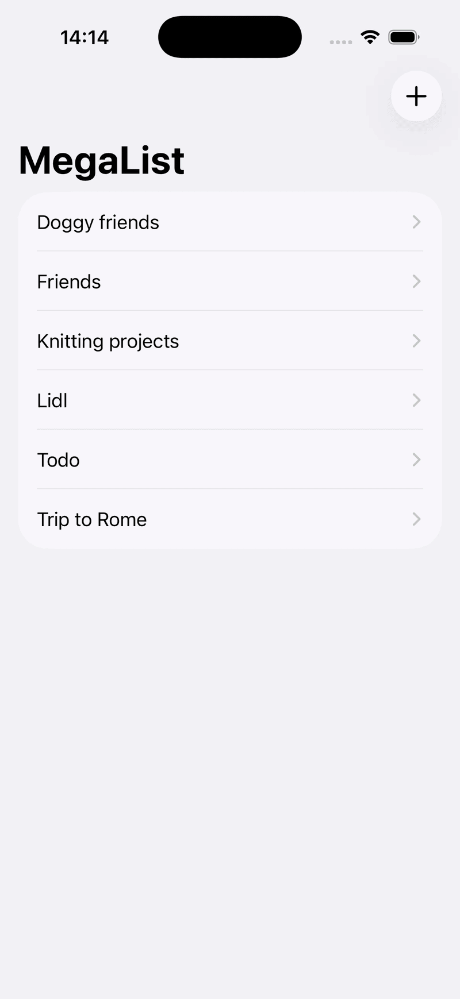
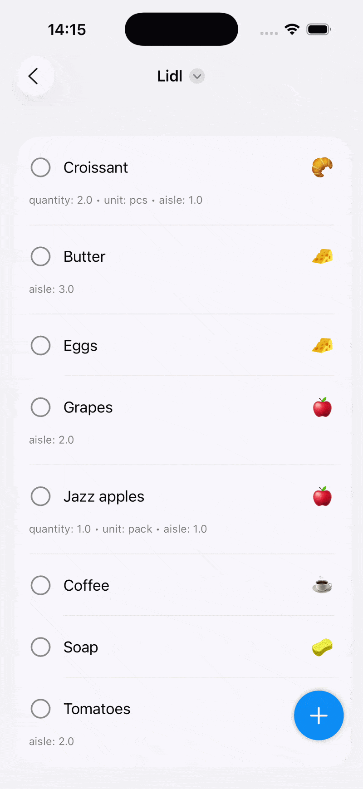

# MegaList
A flexible iOS list app that supports both simple checklists and structured, template driven lists.

## Overview

MegaList is a universal list application that supports everything from simple checklists to structured, template-based lists like groceries, chores, and packing lists.
Each list can optionally use a template to define custom fields (e.g., quantity, due date, priority), while still supporting basic “done” tracking by default.

 
## Demo

<p align="center">
  
</p>

A few example lists.

<p align="center">
  
</p>

Creating a list item and marking it complete.

 
## Installation

```bash
git clone https://github.com/pkoszegi/MegaList.git
```


## Features

- Simple checklist mode (template not required)
- Template defined structured lists
- Dynamic item fields (boolean, text, number, date)
- Optional item categorization
- Built-in starter templates (Groceries, Chores, Packing list, Projects)
- Local persistence using SwiftData


## Tech stack

- Swift
- SwiftUI
- SwiftData
- MVVM architecture


## License

[MIT]
